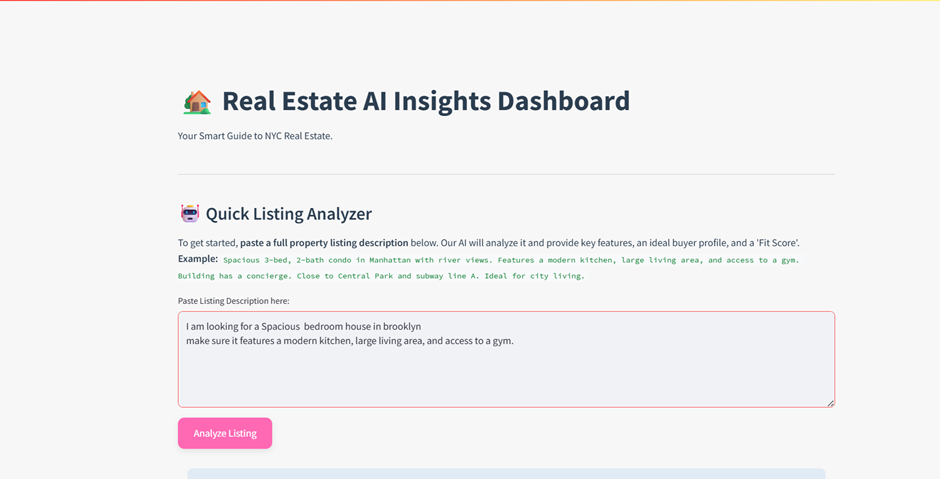
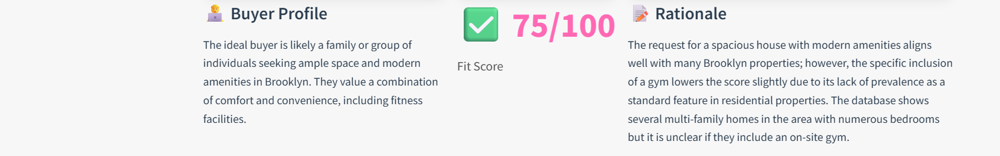

 
 
 This interactive Streamlit application provides AI-powered analysis of property listings and insightful data visualizations for the New York City real estate market. Built with Python, Streamlit, LangChain, and Google Gemini, it serves as a practical demonstration of integrating advanced AI capabilities with data analytics to extract valuable insights from unstructured text and structured datasets.Features
The dashboard offers two primary functionalities:

🤖 Quick Listing Analyzer (AI-Powered with Conceptual RAG)

Paste any New York City property listing description.

Get instant AI-generated insights including:

Key Features: Bullet points highlighting important aspects of the property.

Ideal Buyer Profile: A concise assessment of who the property is best suited for.

Real Estate Fit Score: An integer score (out of 100) indicating general appeal.

Rationale: A brief explanation supporting the fit score.

Conceptual RAG (Retrieval-Augmented Generation): The AI's analysis is augmented by relevant property data conceptually "retrieved" from the NY-House-Dataset.csv, simulating how an LLM can leverage external knowledge bases for richer, more accurate responses.

📈 NYC Neighborhood Hotness Insights (Data-Driven)

Visualize the "hotness" of various NYC neighborhoods based on aggregated data from the dataset.

The "Hotness Score" is a custom metric derived from median property prices and listing volumes.

Interactive filters allow you to explore neighborhood hotness by specific localities/boroughs and median price ranges, offering a dynamic view of market trends.
